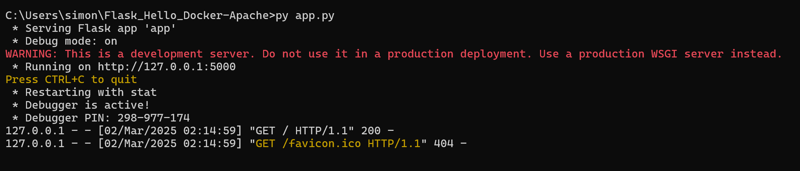
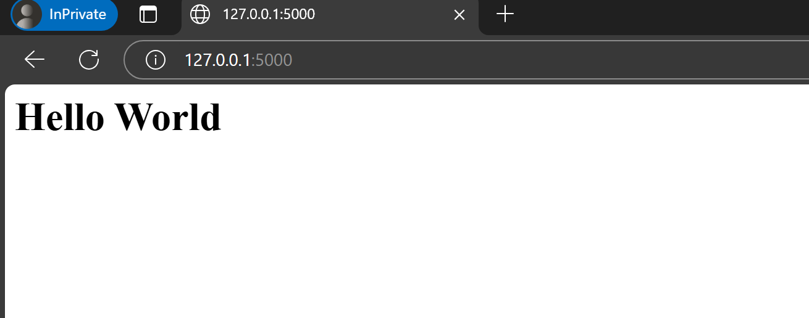

# Code to build app using **flask** localy

1. Make folder to work in,
```bash
mkdir Flask_Hello_Docker-Apache
```

2. Enter in to the folder
```bash
cd Flask_Hello_Docker-Apache
```

3. Install Python 3.13.2 I
Localy on Windows, link to version: https://www.python.org/downloads/release/python-3132/

4. Install flask
```bash
py -m pip install flask
```

5. Create app.py
```sh
echo. > app.py
```

6. Open code editor I use Visual Studio
```sh
start devenv .
```
> [!NOTE]
> Opened the project in VS Code:```code .```

7. Add the code to app.py
```py
from flask import Flask
app = Flask(__name__)

@app.route('/')
def index():
    return '<h1>Hello World</h1>'

if __name__ == '__main__':
    app.run(debug=True)
```

**app.run(debug=True)** only in development, but disable it in production:
```py
app.run(debug=False)
```

8. Run the application with:
```sh
py app.py
```

Image from the terminal:



Image of it running:


