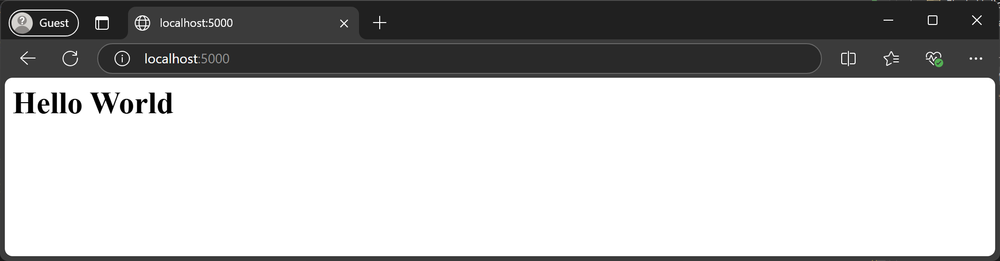

# Using docker localy with (flask)

1. First install docker
Installed from: https://www.docker.com/


2. Change the **app.py** `if __name__ == '__main__': app.run(debug=True)` to:
```py
if __name__ == '__main__':
    app.run(host='0.0.0.0', port=5000)
```

3. Add requirements.txt include "flask":
```PowerShell
"flask" | Out-File -FilePath requirements.txt
```

4. Create dockerfile
```PowerShell
New-Item -ItemType File -Path Dockerfile
```

5. Edit the dockerfile to include
```dockerfile
FROM python:3.9

WORKDIR /app

COPY . /app

# Install dependencies
RUN pip install --no-cache-dir -r /app/requirements.txt

EXPOSE 5000

CMD ["python", "app.py"]
```

6. Run the Docker:
```sh
docker build -t flask-app .
```
7. Run the Flask app in a container:
```sh
docker run -d -p 5000:5000 --name flask_container flask-app
```

Img of the result:



---

### Extra

1. Chek running Running Containers
```sh
docker ps
```

Shows: 
| CONTAINER ID | IMAGE      | COMMAND         | CREATED       | STATUS       | PORTS                  | NAMES            |
|-------------|-----------|----------------|--------------|-------------|------------------------|------------------|
| 7de03cd4d4d6 | flask-app | "python app.py" | 9 minutes ago | Up 9 minutes | 0.0.0.0:5000->5000/tcp | flask_container |


2. Stop container:
```sh
docker stop flask_container
```
3. Remove container:
```sh
docker rm flask_container
```
4. List all images:
```sh
docker images
```

| REPOSITORY | TAG      | IMAGE ID          | CREATED       | SIZE      |        
|-------------|-----------|----------------|--------------|-------------|
| flask-app | latest | 9e26a01eaa59 | 16 minutes ago | 1.47GB |

6.  Remove the Docker Image
```sh
docker rmi flask-app
```
Untagged: flask-app:latest
Deleted: sha256:9e26a01eaa59639f4e7afa8956d7db89043d29886ff325b3671229cd30072d4d

---


